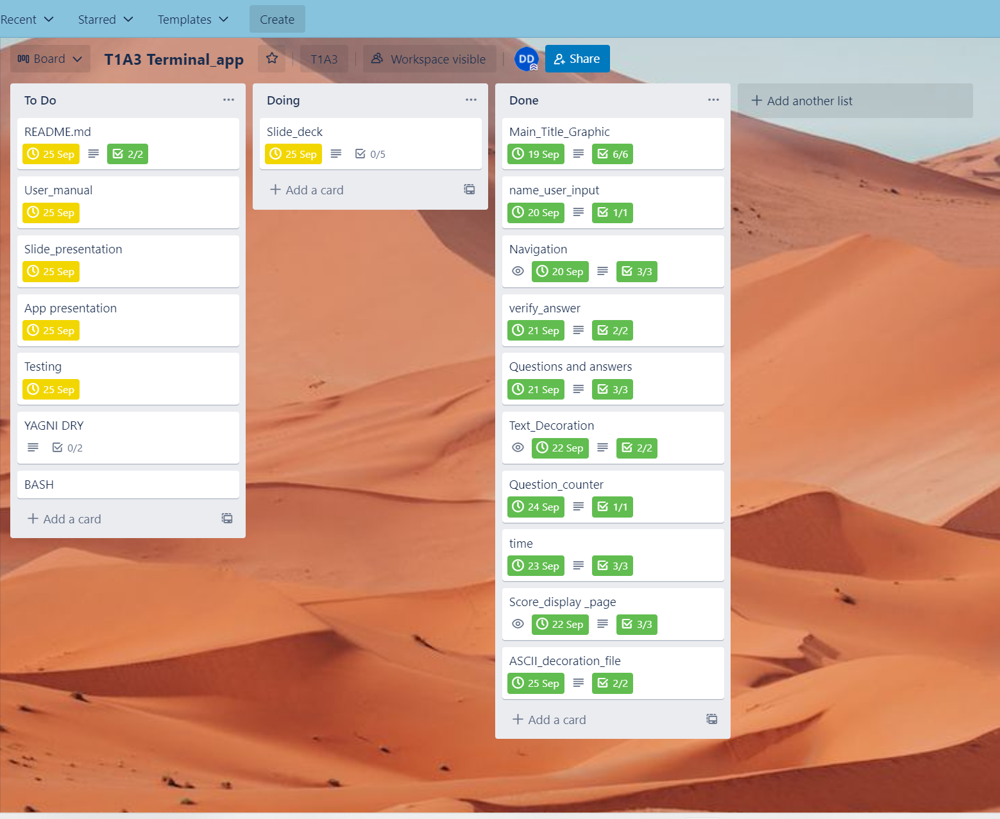

# DylanDavidson_T1A3    
# Dark Matter - Daily Brain Teaser Game.  
[T1A3 Repository](https://github.com/Cheese-steak-jimmys/T1A3)  
[Trello board-T1A3](https://trello.com/invite/b/IWKUd6KC/02fde642b7e5530dbfdf037807ecee2a/t1a3-terminalapp)  
[T1A3 Slidedeck Presentation] (https://github.com/  
['Grey Matter' Terminal App Walkthrough]  
_____________________  
## App Development  
'Grey Matter' is a game developed for users/players to have fun answering a short multiple choice quiz, keeping those brain juices flowing.  
The intention is to have the user spend a short moment each day to test their knowledge, learn new facts and see their performance.  

## Develop a list of features that will be included in the application. It must include:
## - at least THREE features
## - describe each feature    
Some of the key features are:  

* Identify Player 
Play inputs name, nickname or handle of choice.  

* Busy Bee's time feature  
Grey matter is designed for quick enjoyment in an ever busy world. The player is made aware of time with a clock provided at the beginning and end of game.

* Foward Flowing  
  A 'press any key to continue' feature helps the app flow forward seamlessly, like an arcade game.  
   
* Player Input  
  6 questions from a variety of topics are asked with multiple choice answers for the player to input.  

* User Feedback  
   Output is displayed after each answer is given. Eg. "Thats not correct! Its option A".  

* Track Question  
  A ticker is added to view what question the player is on and thus, how many remain. Eg. 'Question 2 of 6'.  

* Performance Review  
  A score page is added for the player to review their playplaythrough against the correct answers.  

* Positive Encouragement Function 
  Output is given depending on how well the player scored. Eg. <25% 'room for improvement', >50% 'outstanding'.  
  
* Players Choice Loop  
 A loop has be written to give the player a choice to replay the days questions for review, learning and enjoyment.  

* Sayonara and time function  
  If the player chooses to exit, A farewell message and a readout is provided of the time remaining until next game(next day).  
    __________________________________  
## Trello Implementation Plan 
