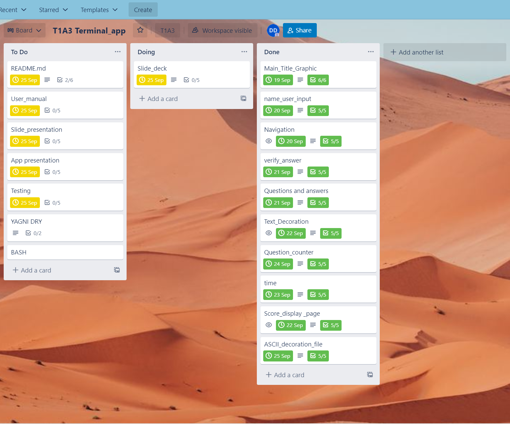

# DylanDavidson_T1A3    
# Dark Matter - Daily Brain Teaser Game.(beta)  
## [T1A3 Repository](https://github.com/Cheese-steak-jimmys/T1A3)  
## [Trello board-T1A3](https://trello.com/invite/b/IWKUd6KC/02fde642b7e5530dbfdf037807ecee2a/t1a3-terminalapp)  
## [T1A3 Slidedeck Presentation](https://youtu.be/_EPeFcBUZG4)  
## ['Grey Matter' Terminal App Walkthrough](https://youtu.be/E7D_ChPnZE0) 
_____________________  
## App Development  
"Grey Matter" is a game developed for users/players to have fun answering a short multiple choice quiz, keeping those brain juices flowing.  
The intention is to have the user spend a short moment each day to test their knowledge, learn new facts and see their performance.  
  
## User Story
### As a < Gaming Fact Lover >, I want < To Play A Quick Brain Teaser  > so that < I can have Fun While Investing little time and energy >
The intended user is anyone wanting a short, fun and educational challenge to fill in a small moment of the day. A wide array of question style and topics should find most users grey matter to be sated.
## Develop a list of features that will be included in the application. It must include:
## - at least THREE features
## - describe each feature    
Some of the key features are:  

* Identify Player  
  Player inputs name, nickname or handle of choice.  

* Busy Bee's time feature  
Grey matter is designed for quick enjoyment in an ever busy world. The player is made aware of time with a clock provided at the beginning and end of game.

* Foward Flowing  
  A 'press any key to continue' feature helps the app flow forward seamlessly, like an arcade game.  
   
* Player Input  
  6 questions from a variety of topics are asked with multiple choice answers for the player to input.  

* User Feedback  
   Output is displayed after each answer is given. Eg. "Thats not correct! Its option A".  

* Track Question  
  A ticker is added to view what question the player is on and thus, how many remain. Eg. 'Question 2 of 6'.  

* Performance Review  
  A score page is added for the player to review their playplaythrough against the correct answers.  

* Positive Encouragement Function  
  Output is given depending on how well the player scored. Eg. <25% 'room for improvement', >50% 'outstanding'.  
  
* Players Choice Loop  
 A loop has be written to give the player a choice to replay the days questions for review, learning and enjoyment.  

* Sayonara and time function  
  If the player chooses to exit, A farewell message and a readout is provided of the time remaining until next game(next day).  
    __________________________________  
## Style convention  
### PEP 8  
* Virtual Studio's default formatter autopep8 and the popular 'black' module have been used to adhere to this style guide.  
 ______________________________   
## Grey Matter - Help Documentation For Executing App  
## [Requirements.txt](src/requirements.txt) -- For the required modules.  
Run this code to  verify the required python version.  
```sh  
#!/bin/bash

source .venv/bin/activate

if [[ -x "$(command -v python)" ]]
then
    pyv="$(python -V 2>&1)"
    if [[ $pyv == "Python 3"* ]]
    then
        python main.py
    else
        echo "Wrong version of python installed" >&2
    fi 
else
    echo "ERR: python3 not installed" >&2
fi
  ```  
  Run the app by moving into its working directory and use python3 +the file name (main.py).  
  ```sh  
    #Eg.  
    \src\DylanDavidson_T1A3\python3 main.py
```
### Game Instructions   
* By design, this game is forward flowing and very easy to use.  
* The user simply has to follow the prompts.  
* There is a requirement to press enter after the input is given for the question choice, replay choice and name entry.
__________________________
## Trello Implementation Plan 
  
___________________________________  
## App Shots    
### Main Screen
   
## User Input Screen
  
## Quiz   
  
## Score Review   
  
## Final Screen   
  

## References   
## [ASCII Art Source](https://www.asciiart.eu/)  
## [App Modules From Pypi](https://pypi.org/search/?q=termcolor)  

